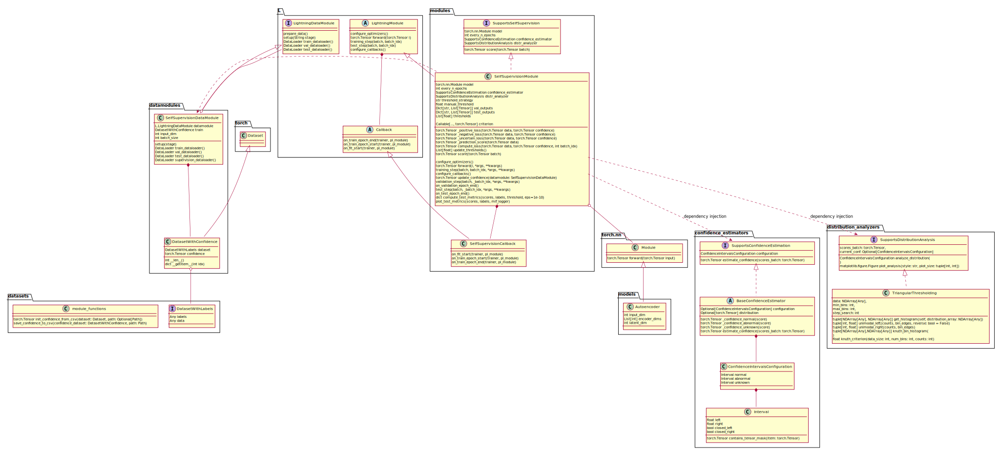
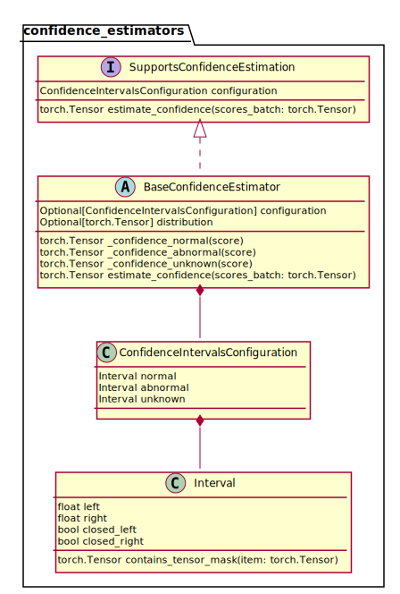
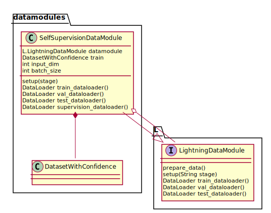
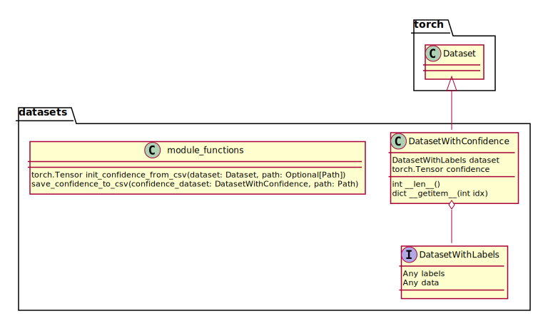
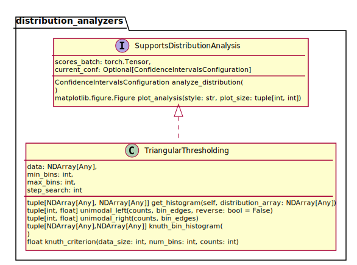
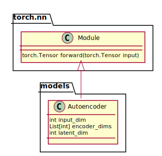
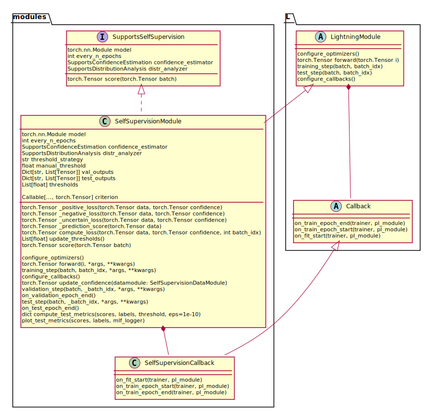
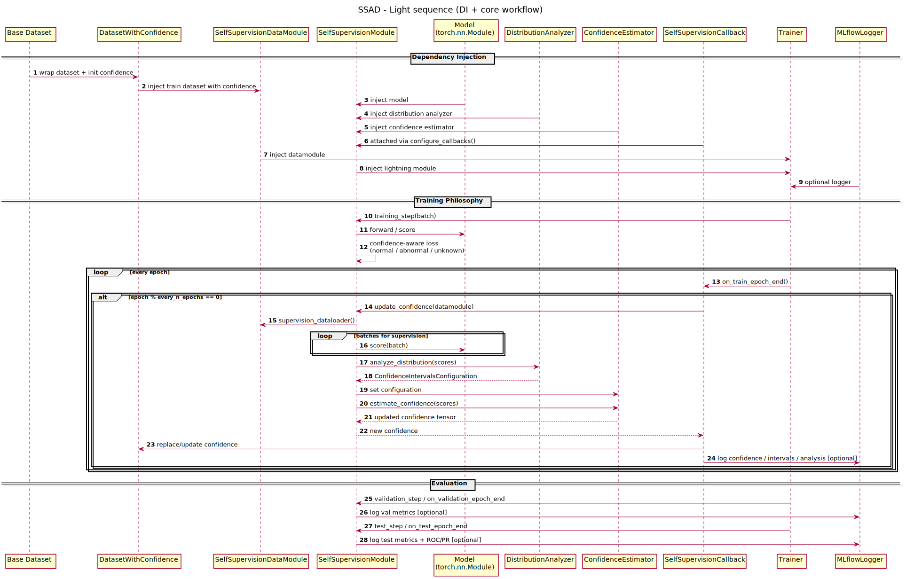

# SSAD — Self-Supervised Anomaly Detection Library

A Python library for autoencoder-based **anomaly detection** based on self-supervised training with dynamic **sample confidence** updates.

## Purpose

This library is designed to:

- train a model that produces an **anomaly score**;
- estimate per-sample **confidence** from that score;
- analyze score distributions to periodically recalibrate confidence intervals corresponding to normal, abnormal and unknown samples;
- apply different losses depending on confidence regions, which can take confidence and intervals into account to reweight samples;
- track experiments, metrics, and artifacts with **MLflow** and an SQL backend store.

NB: examples are proposed in the [examples folder](examples). They correspond to the implementation of the RADON and GRAnD anomaly detection models.

[1] N. Najari, S. Berlemont, G. Lefebvre, S. Duffner, et C. Garcia, « Robust Variational Autoencoders and Normalizing Flows for Unsupervised Network Anomaly Detection », in Advanced Information Networking and Applications, vol. 450, L. Barolli, F. Hussain, et T. Enokido, Éd., in Lecture Notes in Networks and Systems, vol. 450. , Cham: Springer International Publishing, 2022, p. 281‑292. doi: 10.1007/978-3-030-99587-4_24.

[2] N. Najari, S. Berlemont, G. Lefebvre, S. Duffner, et C. Garcia, « RADON: Robust Autoencoder for Unsupervised Anomaly Detection », in 2021 14th International Conference on Security of Information and Networks (SIN), déc. 2021, p. 1‑8. doi: 10.1109/SIN54109.2021.9699174.

---

## Installation

```
pip install -e .
```

or, to launch examples,

```
pip install -e .[dev]
```

---

## Visualize results
Define the tracking URI in the MLflow configuration of the experiment:

```
tracking_uri=f"sqlite:///<path-to>/mlflow.db",
```

then start the server to visualize the results and artefacts:

```
mlflow ui --backend-store-uri sqlite:////<path-to>/mlflow.db
```

## High-Level Architecture

The codebase is split into focused modules:

- `confidence_estimators`: confidence estimation logic from model scores.
- `distribution_analyzers`: score distribution analysis and interval extraction.
- `datamodules`: Lightning data wrapping with confidence-aware datasets.
- `datasets`: dataset types and confidence I/O helpers.
- `modules`: self-supervision training module and callback.
- `models`: PyTorch model definitions (e.g., autoencoder).
- `loggers`: MLflow utility functions for artifacts and metrics logging.

Consolidated class diagram:  


---

## Class Diagrams

All PlantUML source files are in:

- `docs/diagrams/*.plantuml`

### 1) Confidence Estimators
- UML source: `docs/diagrams/confidence_estimators.plantuml`
- Figure:  
  

Main elements:

- `SupportsConfidenceEstimation` (Protocol)
- `BaseConfidenceEstimator` (abstract)
- `ConfidenceIntervalsConfiguration`
- `Interval` (extends `pandas.Interval`)

---

### 2) Data Modules
- UML source: `docs/diagrams/datamodules.plantuml`
- Figure:  
  

Main elements:

- `SelfSupervisionDataModule` wrapping a Lightning datamodule
- Integration with `DatasetWithConfidence`

---

### 3) Datasets
- UML source: `docs/diagrams/datasets.plantuml`
- Figure:  
  

Main elements:

- `DataFrameWithLabels`
- `DatasetWithLabels` / `DatasetWithInputDim` (Protocols)
- `DatasetWithConfidence`
- Utility functions:
  - `init_confidence_from_csv`
  - `save_confidence_to_csv`

---

### 4) Distribution Analyzers
- UML source: `docs/diagrams/distribution_analyzers.plantuml`
- Figure:  
  

Main elements:

- `SupportsDistributionAnalysis` (Protocol)
- Concrete analyzer implementations (e.g., thresholding strategies)

---

### 5) Models
- UML source: `docs/diagrams/models.plantuml`
- Figure:  
  

Main elements:

- `torch.nn.Module`
- `Autoencoder`

---

### 6) Self-Supervision Modules
- UML source: `docs/diagrams/modules.plantuml`
- Figure:  
  

Main elements:

- `SupportsSelfSupervision` (Protocol)
- `SelfSupervisionModule` (abstract Lightning module)
- `SelfSupervisionCallback`
- Dependency injection of:
  - `SupportsConfidenceEstimation`
  - `SupportsDistributionAnalysis`

---

## Training Loop (Conceptual)

1. The model computes per-sample scores (`score` / `_prediction_score`).
2. Distribution analysis derives confidence intervals.
3. Confidence estimator maps scores to confidence values.
4. Training dataset is refreshed with updated confidence.
5. Loss computation uses confidence-aware behavior (normal/abnormal/uncertain).
6. Confidence and intervals are recalibrated every `every_n_epochs`.
7. Metrics and artifacts are logged.

---

## Global workflow



---

## Logging

`ssad/loggers/mlflow_logger.py` provides helper functions to log:

- confidence CSV snapshots (`confidence_epoch_*.csv`)
- confidence interval JSON files (`confidence_intervals_epoch_*.json`)
- distribution analysis figures (`confidence_analysis_epoch_*.svg`)
- system metrics (CPU / RAM / GPU)
- test metrics by threshold (`test_metrics_threshold=*.json`)

---

## Main Dependencies

- Python 3.10+
- PyTorch
- Lightning
- NumPy / pandas / scikit-learn / matplotlib
- MLflow
- psutil

---

## Typical Usage (High-Level)

1. Prepare a dataset compatible with:
   - `DatasetWithLabels`
   - `DatasetWithInputDim`
2. Build your base `LightningDataModule`.
3. Wrap it with `SelfSupervisionDataModule`.
4. Instantiate:
   - a model (`nn.Module`)
   - a confidence estimator (`SupportsConfidenceEstimation`)
   - a distribution analyzer (`SupportsDistributionAnalysis`)
   - a concrete `SelfSupervisionModule`
5. Train/evaluate with Lightning `Trainer`.